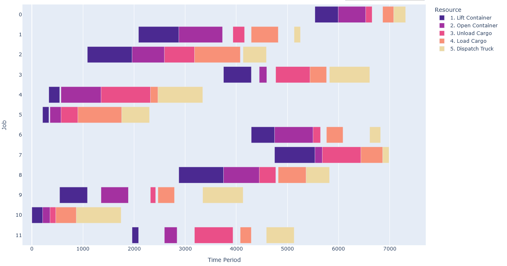

# Flow Shop Scheduling
[Job shop scheduling](https://en.wikipedia.org/wiki/Job-shop_scheduling) (JSS) is an optimization problem where the goal is to schedule jobs on a certain number of machines according to a process order for each job. The objective is to minimize the length of schedule also called make-span, or completion time of the last task of all jobs. [Flow shop scheduling](https://en.wikipedia.org/wiki/Flow-shop_scheduling) (FSS) is a contrained case of JSS where every job uses every machine in the exact same order. Often, for FSS problems, machines can instead be seen as sequential operations that need to be executed on each job rather than actual machines, as is the case in this particular demo.

This example demonstrates a means of formulating and optimizing FSS using a quantum hybrid solver --- either the NL Solver or a [constrained quadratic model](https://docs.ocean.dwavesys.com/en/stable/concepts/cqm.html#cqm-sdk) (CQM) that can be solved using a Leap hybrid CQM solver --- or a classical mixed-integer linear solver. Contained in this example is the code for running the scheduler either via the command line or using a visual interface built with [Dash](https://dash.plotly.com/).

## Usage
To run the job shop demo with the visual interface, from the command line enter

    python app.py

This will launch a local instance of the application on localhost. The default run location is http://127.0.0.1:8050/. Open the location in a web browser to view the application.

To run the stand-alone flow shop demo (without the user interace), use the command:

    python job_shop_scheduler.py [-h] [-i INSTANCE] [-tl TIME_LIMIT] [-os OUTPUT_SOLUTION] [-op OUTPUT_PLOT] [-m] [-v] [-q] [-p PROFILE] [-mm MAX_MAKESPAN]

This will call the flow shop scheduling algorithm for the input instance file. Command line arguments are defined as:
- -h (or --help): show this help message and exit
- -i (--instance): path to the input instance file; see `app_configs.py` for instance names (default: input/tai20_5.txt)
- -tl (--time_limit) time limit in seconds (default: None)
- -os (--output_solution): path to the output solution file (default: output/solution.txt)
- -op (--output_plot): path to the output plot file (default: output/schedule.png)
- -m (--use_scipy_solver): Whether to use the HiGHS via SciPy solver instead of the CQM solver (default: True)
- -m (--use_nl_solver): Whether to use the NL solver instead of the CQM solver (default: False)
- -v (--verbose): Whether to print verbose output (default: True)
- -p (--profile): The profile variable to pass to the Sampler. Defaults to None. (default: None)
- -mm (--max_makespan): Upperbound on how long the schedule can be; leave empty to auto-calculate an appropriate value. (default: None)

There are several instances pre-populated under `input` folder. Some of these instances are contained within the `flowshop1.txt` file, retrieved from the [OR-Library], and parsed when initializing the demo. These can be accessed as if they were files in the input folder named according to the instance short names in `flowshop1.txt` (e.g., "car2", "reC13") without any file ending. Other instances were pulled from [E. Taillard's list] of benchmarking instances. If the string "tai" is contained in the filename, the model will expect the input file to match the format used by Taillard.

Note that, for a FSS problem:
- tasks must be executed sequentially
- each job has to perform every operation (use every machine) in a strict order
- a contrained variant of the job-shop-scheduling problem is solved

The following graphic is an plot of a solution for a 12 job x 5 resources FSS problem:

## Model and Code Overview

### Problem Parameters

These are the parameters of the problem:

- `n` : is the number of jobs
- `m` : is the number of machines
- `J` : is the set of jobs (`{0,1,2,...,n}`)
- `M` : is the set of machines (`{0,1,2,...,m}`)
- `T` : is the set of tasks (`{0,1,2,...,m}`) that has same dimension as `M`.
- `M_(j,t)`:  is the machine that processes task `t` of job `j`
- `T_(j,i)`  : is the task that is processed by machine `i` for job `j`
- `D_(j,t)`:  is the processing duration that task `t` needs for job `j`
- `V`:  maximum possible make-span

### Variables

- `w` is a positive integer variable that defines the completion time (make-span)
of the JSS
- `x_(j_i)` are positive integer variables used to model start of each job `j` on
  machine `i`
- `y_(j_k,i)` are binaries which define if job `k` precedes job `j` on machine `i`

### Objective

Our objective is to minimize the make-span (`w`) of the given JSS problem.

### Constraints
#### Precedence Constraint

Our first constraint, [equation 1](#eq2), enforces the precedence constraint.
This ensures that all tasks of a job are executed in the given order.

          (1)

This constraint ensures that a task for a given job, `j`, on a machine, `M_(j,t)`,
starts when the previous task is finished. As an example, for consecutive
tasks 4 and 5 of job 3 that run on machine 6 and 1, respectively,
assuming that task 4 takes 12 hours to finish, we add this constraint:
`x_3_6 >= x_3_1 + 12`

#### No-Overlap Constraints
Our second constraint, [equation 2](#eq2), ensures that multiple jobs don't use any machine at the same time.
          (2)

Usually this constraint is modeled as two disjunctive linear constraints ([Ku et al. 2016](#Ku) and [Manne et al. 1960](#Manne)); however, it is more efficient to model this as a single quadratic inequality constraint. In addition, using this quadratic equation eliminates the need for using the so called `Big M` value to activate or relax constraint (https://en.wikipedia.org/wiki/Big_M_method).

The proposed quadratic equation fulfills the same behaviour as the linear constraints:

There are two cases:
- if `y_j,k,i = 0` job `j` is processed after job `k`:
  
- if `y_j,k,i = 1` job `k` is processed after job `j`:
  
  Since these equations are applied to every pair of jobs, they guarantee that the jobs don't overlap on a machine.

#### Make-Span Constraint
In this demonstration, the maximum makespan can be defined by the user or it will be determined using a greedy heuristic. Placing an upper bound on the makespan improves the performance of the D-Wave sampler; however, if the upper bound is too low then the sampler may fail to find a feasible solution.

## References

A. S. Manne, On the job-shop scheduling problem, Operations Research , 1960,
Pages 219-223.

Wen-Yang Ku, J. Christopher Beck, Mixed Integer Programming models for job
shop scheduling: A computational analysis, Computers & Operations Research,
Volume 73, 2016, Pages 165-173.

## License

Released under the Apache License 2.0. See [LICENSE](LICENSE) file.

[E. Taillard's list]: http://mistic.heig-vd.ch/taillard/problemes.dir/ordonnancement.dir/ordonnancement.html
[OR-Library]: https://people.brunel.ac.uk/~mastjjb/jeb/orlib/flowshopinfo.html
