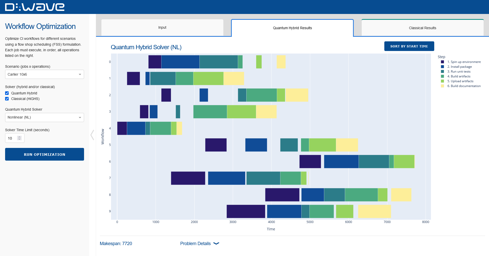

[](
  https://codespaces.new/dwave-examples/flow-shop-scheduling?quickstart=1)

# Flow Shop Scheduling

[Job shop scheduling](https://en.wikipedia.org/wiki/Job-shop_scheduling) (JSS)
is an optimization problem with the goal of scheduling jobs on a variety of machines,
where jobs are processed on machines in different orders. The objective is to
minimize the time it takes to complete all jobs, also known as the "makespan".
[Flow shop scheduling](https://en.wikipedia.org/wiki/Flow-shop_scheduling) (FSS)
is a constrained case of JSS where each job uses each machine in the same
order. The machines in FSS problems can often be seen as sequential operations
to be executed on each job, as is the case in this example.

This is a basic example of flow show scheduling that can easily be extended to different
objectives, such as minimizing the delay for the scheduled completion of each job.



This example demonstrates three ways of formulating and optimizing FSS:

*   Formulating a
    [nonlinear model](https://docs.dwavequantum.com/en/latest/concepts/models.html#nonlinear-model)
    and solving on a Leap&trade; hybrid nonlinear (NL) solver
*   Formulating a
    [constrained quadratic model](https://docs.dwavequantum.com/en/latest/concepts/models.html#constrained-quadratic-model)
    (CQM) and solving on a Leap hybrid CQM solver
*   Formulating a mixed-integer problem and solving on a classical mixed-integer
    linear solver

This example lets you run the scheduler from either the command line or a visual
interface built with [Dash](https://dash.plotly.com/).

## Installation
You can run this example without installation in cloud-based IDEs that support the
[Development Containers Specification](https://containers.dev/supporting) (aka "devcontainers")
such as GitHub Codespaces.

For development environments that do not support `devcontainers`, install requirements:

```bash
pip install -r requirements.txt
```

If you are cloning the repo to your local system, working in a
[virtual environment](https://docs.python.org/3/library/venv.html) is recommended.

## Usage
Your development environment should be configured to access the
[Leap quantum cloud service](https://docs.dwavequantum.com/en/latest/ocean/sapi_access_basic.html).
You can see information about supported IDEs and authorizing access to your Leap account
[here](https://docs.dwavequantum.com/en/latest/ocean/leap_authorization.html).

Run the following terminal command to start the Dash application:

```bash
python app.py
```

Access the user interface with your browser at http://127.0.0.1:8050/.

The demo program opens an interface where you can configure and submit problems to a solver.

Configuration options can be found in the [demo_configs.py](demo_configs.py) file.

> [!NOTE]\
> If you plan on editing any files while the application is running, please run the application
with the `--debug` command-line argument for easier debugging:
`python app.py --debug`

Alternatively, you can run the flow shop scheduler without the Dash interface using the following
command:

```bash
python job_shop_scheduler.py [-h] [-i INSTANCE] [-tl TIME_LIMIT]
[-os OUTPUT_SOLUTION] [-op OUTPUT_PLOT] [-m] [-v] [-q] [-p PROFILE]
[-mm MAX_MAKESPAN]
```

The command line arguments are as follows:
- -h (or --help): show this help message and exit
- -i (--instance): path to the input instance file (default: input/tai20_5.txt);
  see `app_configs.py` for instance names
- -tl (--time_limit) time limit in seconds (default: None)
- -os (--output_solution): path to the output solution file (default:
  output/solution.txt)
- -op (--output_plot): path to the output plot file (default:
  output/schedule.png)
- -m (--use_scipy_solver): use SciPy's HiGHS solver instead of the CQM solver
  (default: True)
- -m (--use_nl_solver): use the nonlinear solver instead of the CQM solver
  (default: False)
- -v (--verbose): print verbose output (default: True)
- -p (--profile): profile variable to pass to the sampler (default: None)
- -mm (--max_makespan): manually set an upper bound on the schedule length
  instead of auto-calculating (default: None)

### Problem Instances
Several problem instances are available in the `input` folder. Some of
these instances are contained within the `flowshop1.txt` file, retrieved from
the [OR-Library], and parsed when the demo is initialized. These can be accessed
as if they were files in the `input` folder, named according to the instance
short names in `flowshop1.txt` (e.g., "car2", "reC13"), without filename
endings. Other instances were pulled from [E. Taillard's list] of benchmarking
instances. If the string "tai" is in the filename, the model expects the format
used by Taillard.

## Problem Description
The goal of the flow shop scheduling problem is to complete all jobs as quickly as possible.
The model sets the following objectives and constraints to achieve this goal:

**Objectives:** minimize the total completion time (makespan).

**Constraints:** the constraints for this problem fall into multiple categories.
- **Precedence Constraint** ensure that all tasks of a job are executed in the given order.
- **No-Overlap Constraints** ensure no two jobs can execute on the same machine at the same time.
- **Makespan Constraint** (optional) puts an upper bound on the time it takes to complete all jobs.

Constraints are handled differently in the CQM and NL model formulations. The CQM
formulation must explicitly state each constraint and therefore searches a solution space
that includes variable assignments that are infeasible (constraints are violated). The nonlinear
model has no need for explicit constraints as the structure of the model limits potential
solutions to only those that adhere to the constraints. By using implicit constraints to limit
the search space to only valid solutions, the NL solver is often able to find better solutions,
faster.

## CQM Model Overview

### Problem Parameters

- `n`: the number of jobs
- `m`: the number of machines
- `J`: set of jobs (`{0,1,2,...,n-1}`)
- `M`: set of machines (`{0,1,2,...,m-1}`)
- `T`: set of tasks (`{0,1,2,...,m-1}`) that has same dimension as `M`
- `M_(j,t)`:  the machine that processes task `t` of job `j`
- `T_(j,i)`: the task that is processed by machine `i` for job `j`
- `D_(j,t)`:  the processing duration that task `t` needs for job `j`
- `V`:  maximum allowed makespan

### Variables
- `w`: a positive integer variable that defines the completion time (makespan)
  of the JSS
- `x_(j_i)`: positive integer variables used to model start of each job `j` on
  machine `i`
- `y_(j_k,i)`: binaries which define if job `k` precedes job `j` on machine `i`

### Objective
To minimize the total completion time (makespan).

### Constraints
The CQM requires adding a set of explicit constraints to
ensure that tasks are executed in order and that no single machine is used by
different jobs at the same time.

#### Precedence Constraint
Our first constraint, [equation 1](#eq2), enforces the precedence constraint.
This ensures that all tasks of a job are executed in the given order.

          (1)

This constraint ensures that a task for a given job, `j`, on a machine,
`M_(j,t)`, starts when the previous task is finished. As an example, for
consecutive tasks 4 and 5 of job 3 that run on machine 6 and 1, respectively,
assuming that task 4 takes 12 hours to finish, we add this constraint:
`x_3_6 >= x_3_1 + 12`

#### No-Overlap Constraints
Our second constraint, [equation 2](#eq2), ensures that multiple jobs don't use
any machine at the same time.
          (2)

Usually this constraint is modeled as two disjunctive linear constraints
([Ku et al. 2016](#Ku) and [Manne et al. 1960](#Manne)); however, it is more
efficient to model this as a single quadratic inequality constraint. In
addition, using this quadratic equation eliminates the need for using the so
called `Big M` value to activate or relax constraint
(https://en.wikipedia.org/wiki/Big_M_method).

The proposed quadratic equation fulfills the same behaviour as the linear
constraints:

There are two cases:

- if `y_j,k,i = 0` job `j` is processed after job `k`:
  
- if `y_j,k,i = 1` job `k` is processed after job `j`:
  
  Since these equations are applied to every pair of jobs, they guarantee that
  the jobs don't overlap on a machine.

#### Makespan Constraint
In this demonstration, the maximum makespan can be defined by the user or it
will be determined using a greedy heuristic. Placing an upper bound on the
makespan improves the performance of the sampler; however, if the upper
bound is too low then the sampler may fail to find a feasible solution.

## Nonlinear Model Overview
The model for the nonlinear solver is constructed using the
[flow shop scheduling generator](https://docs.dwavequantum.com/en/latest/ocean/api_ref_optimization/generators.html#dwave.optimization.generators.flow_shop_scheduling)
provided in ``dwave-optimization``.

### Problem Parameters

- `processing_times`: an `mXn` array where `processing_times[m, n]` is the duration of job n on
machine m.

### Variables
- `order`: An array of integer variables of length num jobs.

### Objective
To minimize the last job end time.

### Constraints
Typically, solver performance strongly depends on the size of the solution space for the modeled
problem: models with a smaller solution space tend to perform better than ones with a larger space
as there are less potential solutions to search through to find optimal. A powerful way to reduce
the solution space is by using variables that act as implicit constraints. Implicit constraints
limit the solution space to only solutions that adhere to the constraints. The NL solver has many
variable types that allow for model construction to integrate constraints implicitly. In this
problem example, both constraints are handled implicitly.

#### Precedence Constraint
The precedence constraint ensures that all tasks of a job are executed in the given order.

This model uses the
[dwave-optimization](https://docs.dwavequantum.com/en/latest/ocean/api_ref_optimization/index.html)
 ``ListVariable`` to efficiently permutate the order of jobs which prevents violation of this
 constraint, as the constraint is implicitly built into the model.

As can be seen in the two images below, switching the job order can
improve the solution quality, corresponding to a shorter completion
time (makespan).


Above: a solution to a flow shop scheduling problem with 3 jobs on 3 machines.


Above: an improved solution to the same problem with a permutated job order.

#### No-Overlap Constraints
The no-overlap constraint ensures that no two jobs use the same machine at the same time.

The ``max`` operation is used to extract the start time for each job, ensuring there is no overlap
between jobs on machines. This constraint is built into the model and therefore, all solutions in
the solution space adhere to it.

## References
<a id="Manne"></a>
A. S. Manne, On the job-shop scheduling problem, Operations Research , 1960,
Pages 219-223.

<a id="Ku"></a>
Wen-Yang Ku, J. Christopher Beck, Mixed Integer Programming models for job
shop scheduling: A computational analysis, Computers & Operations Research,
Volume 73, 2016, Pages 165-173.

## License

Released under the Apache License 2.0. See [LICENSE](LICENSE) file.

[E. Taillard's list]: http://mistic.heig-vd.ch/taillard/problemes.dir/ordonnancement.dir/ordonnancement.html
[OR-Library]: https://people.brunel.ac.uk/~mastjjb/jeb/orlib/flowshopinfo.html